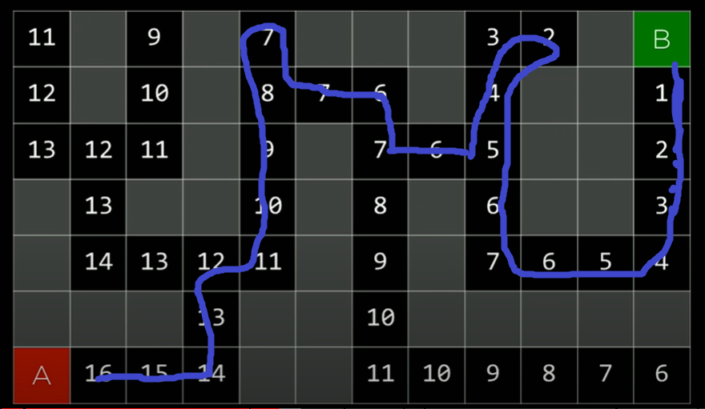

# Search

---
For example, scrambled 15-puzzle. For example, finding way thru a maze.

First, some terminology:

## Terminology

**An agent**: Entity that perceives its environment and acts upon that environment. I.e., a car for driving directions.
For 15-puzzle, person or ai solving is the agent.

**State**: A configuration of the agent. Any random set up of the 15-puzzle.

**Initial state**- starting state. The state where the agent begins.

**Actions**- choices that can be made in a state.

Actions is a function-- ACTION(_s_) returns the set of actions that can be executed in state _s_.

**Transition model** - a description of what state results from performing any applicable action in any state or more
formally:
RESULTS(_s, a_) returns the state resulting from performing action _a_ in the state _s_.


#### For example:

Example state:


Example action:
Sliding a tile to the right.

Example result:


or


If we take this transition model, we can form a State Space

**State Space**: The set of all states reachable from the initial state by any sequence of actions.

We can use a graph with nodes being states and actions being edges.

Next we need to know, when is the AI done? We'll have to add a goal test.

**Goal test**: way to determine weather a given state is the goal state.

There can frequently be multiple ways to solve a goal.

Sometimes a computer doesn't just care about finding the goal, but also the cost.

**Path cost**: Numerical cost associated with a given path.

We want to find paths that minimize the path cost.

For the 15-puzzle, all costs probably have equal cost.

A search problem has a:

- Initial State
- Actions
- Transition Model
- Goal test
- Path cost function

**Optimal solution**: A solution that has the lowest path cost among all possible solutions.

How will we solve this search problem?

We need to represent data on the computer. We're going to do this with a data-structure called a node.

Every **node** will keep track of:

- A state
- A parents (node that generated this node)
- An action (action applied to parent to get node)
- A path cost (from initial state to node)

We will start at a particular state and just explore from there. We will consider all available options in something
called the **frontier**.

#### Our approach:

- Start with a frontier that contains the initial state.
- Repeat:
    - If the frontier is empty, then no solution.
    - Remove a node from the frontier.
    - If node contains goal state, return the solution.
    - Expand the node, add resulting nodes to the frontier. _("Expanding the nodes" means finding all the 'next' nodes
      by 1 action)_

#### For example:

Find a path from A to E:


#### What are the potential problems?

What if our graph looked like this?


If we stupidly apply the same approach now, we can end up in an infinite loop. We have to keep track of what we've
already explored. Once we've explored a state, never go back to it. Don't add it to the frontier.

#### Revised approach:

- Start with a frontier that contains the initial state.
- _Start with an empty explored set._
- Repeat:
    - If the frontier is empty, then no solution.
    - Remove a node from the frontier.
    - If node contains goal state, return the solution.
    - _Add the node to the explored state._
    - Expand the node, add resulting nodes to the frontier _if they aren't already in the frontier or the explored set_.

For now, we've glossed over "Remove a node from the frontier.". This is actually a really important step. One of the
simplest data methods for this is a stack:

**Stack**: Last-in first-out data type

This version of the algorithm is called depth-first search.

**Depth-first search (DFS)**: Search algorithm that always expands the deepest node in the frontier first.

There's another algorithm

**Breadth-first search (BFS)**: Search algorithm that always expands the shallowest node in the frontier. Uses a queue.

**Queue**- first-in first-our data type.

## Depth-first search


Will this always work? As long as the maze is finite, yes, it will work. Eventually, it will explore everything.

Is it the optimal solution? Not necessarily.

## Breadth-first search


Now, we have found the optimal path.

In the larger maze, BFS found the path, but it had to explore even more states.

Now, let's look at some code.

###### SEE ./SRC0

BFS kinda sucked when the goal was far away. It basically explored every single path possible. What would human
intuition have us do?

A human would see that going right looks better than going left. Of course, B is way up in the top right. If we know
everybody's _(x,y)_, then we might use distance formula or something.

So this brings us to two types of search algorithms: informed search and uninformed search.

**Uninformed search**: Search strategies that use no problem-specific knowledge (like DFS and BFS)

**Informed search**: Search strategies that use knowledge specific to the problem to find solutions more efficiently.

**Greedy best-first search**: search algorithm that expands the node that (it thinks) is closest to the goal, as
estimated by a heuristic function _h(n)_.

**Manhattan distance**: How many steps away, ignoring walls, and not taking diagonals. I.e., sum of delta-x plus
delta-y.

Here is the whole grid labeled with its Manhattan distance:




We did much better than BFS. Is this optimal? Will it always find the shortest path? **No**, we can construct a
counterexample.

How can we modify the algorithm to be optimal? _Well_, the heuristic value went down.... then went back up....

## A* search

Search algorithm that expands nodes with the lowest value of _g(n) + h(n)_, where _g(n) =_ cost to reach the node and _
h(n) =_ estimated cost to goal.

Our grid looks the same initially- just manhattan distance. But as we walk along, we will keep track of _g(n)_, the
number of steps we took, and sum this to the Manhattan distance.


A* search is optimal if

- _h(n)_ is admissible (never overestimates the true cost), and
- _h(n)_ is consistent (for ever node _n_ and successor _n'_ with step cost _c_, _h(n) <= h(n') + c_)

## Adversarial Search

Sometimes, there's someone working against me. I want to win, but someone else wants me to fail. The most classic
example-- a game, like tic-tac-toe.

What does an intelligent move in tic-tac-toe look like?

## Minimax

How can we translate tic-tac-toe to numbers? We might assign a number to each outcome:

- O winning: -1
- Tie: 0
- X winning: 1

Now, we'll call X the max player, and O the min player. X wants to maximize the score, and O wants to minimize it. For
example, X would rather tie (0) than have O win (-1).

### Game

- S_0: initial state
- _PLAYER(s)_: returns which player to move in state _s_.
- _ACTIONS(s)_: returns legal moves in state _s_.
- _RESULTS(s, a)_: returns state after action _a_ taken in state _s_.
- _TERMINAL(s)_: checks if state _s_ is a terminal state
- _UTILITY(s)_: final numerical value for terminal state _s_.

In TTT, initial state is empty game board. Player says its X's turn. Etc...

How can we assign a utility value to boards which are not yet terminal? We might look at the set of all legal next
boards. And then, continue recursively, but from our opponent's view. What would our opponent do with each resultant
board? Continue until terminal, then, we assign utility values like this:

- ~~If a board has only 1 outcome, then I have the same utility value as that outcome.~~

- On MAX's turn, the board is equal to the max of the children.
- Otherwise, on MIN's turn, the board is equal to the min of the outcomes.

Then, min user will always choose the path that is minimal.

### Minimax Pseudocode

- Given a state _s_:
    - MAX picks action _a_ in _ACTIONS(s)_ that produces the highest value of _MIN-VALUE(RESULT(s,a))_.
    - MIN picks action _a_ in _ACTIONS(s)_ that produces the smallest value of _MAX-VALUE(RESULT(s,a))_.

```
function MAX-VALUE(state):
    if TERMINAL(state):
        return UTILITY(state)
    v = -infinity
    for action in ACTIONS(state):
        v = MAX(v, MIN-VALUE(RESULT(state, action)))
    return v
    
function MAX-VALUE(state):
    if TERMINAL(state):
        return UTILITY(state)
    v = +infinity
    for action in ACTIONS(state):
        v = MIN(v, MAX-VALUE(RESULT(state, action)))
    return v   
```

But, this gets very long. How can we optimize?

## Alpha-Beta pruning

Keep track of best-so-far and worse-so-far. TTT is relatively simple-- only __255,168__ possible boards. Chess, though,
after 4 moves, has more than _288 billion_. More than _10 ** 29_000_ chess games. This is a problem for minimax!

## Depth-Limited Minimax

We need to limit to depth to stay realistic. 

**Evaluation function**: The expected utility of a game at any state. 

The better the evaluation function, the better the AI. 
  